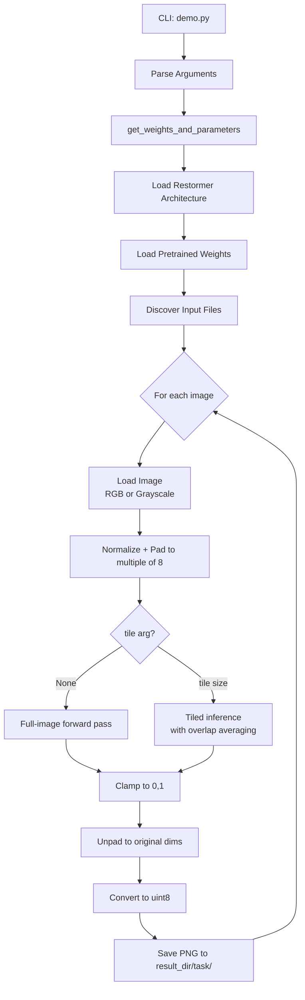
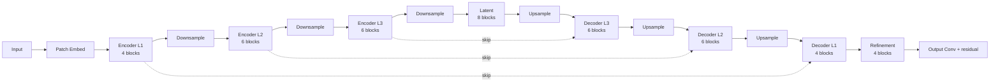

# Design Document: Restormer Image Restoration Pipeline

## Overview

The Restormer image restoration pipeline is a CLI-driven inference system built on an Efficient Transformer architecture for high-resolution image restoration. The entry point is `demo.py`, which orchestrates argument parsing, model configuration, image discovery, preprocessing, inference (standard or tiled), and output saving.

The system supports six restoration tasks, each backed by task-specific pretrained weights and model parameter overrides. The design is intentionally simple: a single-file script with pure utility functions and a linear execution flow, making it easy to test individual components in isolation.

## Architecture



The architecture follows a U-Net style encoder-decoder with 4 resolution levels. Skip connections link encoder and decoder at each level. A refinement stage follows the decoder. The final output adds a residual connection from the input image (for non-dual-pixel tasks).



## Components and Interfaces

### `get_weights_and_parameters(task, parameters) -> (weights_path, parameters)`

Maps a task name to its pretrained weights path and applies task-specific parameter overrides to the base parameters dict. This is a pure function with no side effects.

| Task | Weights Path | Parameter Overrides |
|------|-------------|---------------------|
| Motion_Deblurring | `Motion_Deblurring/pretrained_models/motion_deblurring.pth` | none |
| Single_Image_Defocus_Deblurring | `Defocus_Deblurring/pretrained_models/single_image_defocus_deblurring.pth` | none |
| Deraining | `Deraining/pretrained_models/deraining.pth` | none |
| Real_Denoising | `Denoising/pretrained_models/real_denoising.pth` | `LayerNorm_type='BiasFree'` |
| Gaussian_Color_Denoising | `Denoising/pretrained_models/gaussian_color_denoising_blind.pth` | `LayerNorm_type='BiasFree'` |
| Gaussian_Gray_Denoising | `Denoising/pretrained_models/gaussian_gray_denoising_blind.pth` | `inp_channels=1, out_channels=1, LayerNorm_type='BiasFree'` |

### `load_img(filepath) -> np.ndarray`

Loads an image as a 3-channel RGB array using OpenCV (BGR→RGB conversion).

### `load_gray_img(filepath) -> np.ndarray`

Loads an image as a single-channel grayscale array with shape `(H, W, 1)`.

### `save_img(filepath, img)`

Saves a 3-channel RGB image as PNG (RGB→BGR conversion for OpenCV).

### `save_gray_img(filepath, img)`

Saves a single-channel grayscale image as PNG.

### Padding Logic (inline in `demo.py`)

Given input tensor of shape `(1, C, H, W)`, computes pad amounts so that `H` and `W` become the next multiple of 8. Uses `F.pad` with `'reflect'` mode.

### Standard Inference (inline in `demo.py`)

Single forward pass: `restored = model(input_)`.

### Tiled Inference (inline in `demo.py`)

Divides the padded input into overlapping tiles. For each tile position `(h_idx, w_idx)`, runs a forward pass and accumulates results into an energy tensor `E` and weight tensor `W`. Final result: `E / W` (averaging overlapping regions).

Tile index generation:
```
stride = tile - tile_overlap
h_idx_list = list(range(0, h-tile, stride)) + [h-tile]
w_idx_list = list(range(0, w-tile, stride)) + [w-tile]
```

### `Restormer` (in `basicsr/models/archs/restormer_arch.py`)

The neural network. Loaded dynamically via `run_path`. Key parameters:

| Parameter | Default | Notes |
|-----------|---------|-------|
| `inp_channels` | 3 | Set to 1 for grayscale denoising |
| `out_channels` | 3 | Set to 1 for grayscale denoising |
| `dim` | 48 | Base feature dimension |
| `num_blocks` | [4,6,6,8] | Transformer blocks per encoder level |
| `num_refinement_blocks` | 4 | Refinement stage blocks |
| `heads` | [1,2,4,8] | Attention heads per level |
| `ffn_expansion_factor` | 2.66 | FFN hidden dim multiplier |
| `bias` | False | |
| `LayerNorm_type` | 'WithBias' | Set to 'BiasFree' for denoising tasks |
| `dual_pixel_task` | False | |

## Data Models

### CLI Arguments

```python
args.task: str          # One of 6 valid task names (required)
args.input_dir: str     # Path to image file or directory (default: './demo/degraded/')
args.result_dir: str    # Root output directory (default: './demo/restored/')
args.tile: int | None   # Tile size in pixels; None = full-image inference
args.tile_overlap: int  # Overlap between tiles in pixels (default: 32)
```

### Image Tensor Pipeline

```
Input file (H, W, C) uint8
  → numpy array float32 / 255.0
  → torch tensor (1, C, H, W) float32
  → padded tensor (1, C, H', W') where H'%8==0, W'%8==0
  → model output (1, C, H', W') float32
  → clamped to [0, 1]
  → cropped to (1, C, H, W)
  → permuted to (H, W, C) numpy
  → img_as_ubyte → uint8
  → saved as PNG
```

### Task-to-Weights Mapping

Resolved at runtime by `get_weights_and_parameters`. Weights are `.pth` files containing a dict with a `'params'` key holding the model state dict.

## Correctness Properties

*A property is a characteristic or behavior that should hold true across all valid executions of a system — essentially, a formal statement about what the system should do. Properties serve as the bridge between human-readable specifications and machine-verifiable correctness guarantees.*

### Property 1: Padding produces dimensions divisible by 8

*For any* image height H and width W, after applying the padding logic, both the padded height H' and padded width W' shall be divisible by 8.

**Validates: Requirements 3.3**

### Property 2: Unpadding restores original dimensions

*For any* image with original dimensions (H, W), after padding to (H', W') and then cropping back to `[:, :, :H, :W]`, the resulting tensor shall have spatial dimensions exactly (H, W).

**Validates: Requirements 4.3, 5.7**

### Property 3: Output values are clamped to [0, 1]

*For any* output tensor produced by the model (standard or tiled inference), after applying `torch.clamp(restored, 0, 1)`, every element shall satisfy `0 <= value <= 1`.

**Validates: Requirements 4.2, 5.6**

### Property 4: File discovery returns supported files in natural sort order

*For any* directory containing a mix of image files (with supported extensions: jpg, JPG, png, PNG, jpeg, JPEG, bmp, BMP) and non-image files, the file discovery logic shall return exactly the image files, in natural sort order.

**Validates: Requirements 2.2, 2.3**

### Property 5: Tile coverage is complete

*For any* padded image of dimensions (H, W) and any tile size T ≤ min(H, W) that is a multiple of 8, the union of all tile regions `[h_idx:h_idx+T, w_idx:w_idx+T]` generated by the tiling logic shall cover every pixel position in the image.

**Validates: Requirements 5.1**

### Property 6: Tile size is clamped to image dimensions

*For any* tile size T and image with dimensions (H, W), the effective tile size used shall be `min(T, H, W)`.

**Validates: Requirements 5.4**

### Property 7: Output path is task-scoped subdirectory

*For any* result directory path and task name, the output directory shall be `os.path.join(result_dir, task)`.

**Validates: Requirements 6.2**

### Property 8: Output filename preserves input base name with PNG extension

*For any* input filepath, the output filename shall be `os.path.splitext(os.path.basename(filepath))[0] + '.png'`.

**Validates: Requirements 6.4**

## Error Handling

| Condition | Behavior |
|-----------|----------|
| Invalid or missing `--task` | argparse raises `SystemExit` with error message |
| Weights file not found | `torch.load` raises `FileNotFoundError`; execution halts |
| No supported images at `--input_dir` | `raise Exception(f'No files found at {inp_dir}')` |
| Tile size not multiple of 8 | `assert tile % 8 == 0` raises `AssertionError` |
| Output directory missing | `os.makedirs(out_dir, exist_ok=True)` creates it |

## Testing Strategy

### Dual Testing Approach

Unit tests cover specific examples, edge cases, and error conditions. Property-based tests verify universal properties across a wide input space.

### Property-Based Testing

Use **Hypothesis** (Python) for property-based tests. Configure each test with `@settings(max_examples=100)`.

Each property test references its design property via a comment:
```python
# Feature: restormer-image-restoration, Property N: <property_text>
```

**Property 1 — Padding divisibility:**
Generate arbitrary (H, W) pairs. Apply the padding formula. Assert `H' % 8 == 0` and `W' % 8 == 0`.

**Property 2 — Unpadding round-trip:**
Generate arbitrary (H, W) pairs. Pad to (H', W'). Crop back to (H, W). Assert shape equals original.

**Property 3 — Clamping invariant:**
Generate arbitrary float tensors with values outside [0, 1]. Apply `torch.clamp`. Assert all values in [0, 1].

**Property 4 — File discovery:**
Generate arbitrary sets of filenames (mix of supported and unsupported extensions). Assert discovered files match supported-extension files in natsorted order.

**Property 5 — Tile coverage:**
Generate arbitrary (H, W, T, overlap) combinations where T ≤ min(H, W) and T % 8 == 0. Build the index lists. Assert every (h, w) coordinate is covered by at least one tile.

**Property 6 — Tile size clamping:**
Generate arbitrary T, H, W. Assert `min(T, H, W) == min(args.tile, h, w)` as computed by the code.

**Property 7 — Output path:**
Generate arbitrary result_dir strings and task names. Assert output dir equals `os.path.join(result_dir, task)`.

**Property 8 — Output filename:**
Generate arbitrary input filepaths with various extensions and directory structures. Assert output filename equals `stem + '.png'`.

### Unit Tests

Focus on specific examples and error conditions:

- `get_weights_and_parameters` returns correct weights path and parameters for each of the 6 tasks
- `get_weights_and_parameters` correctly overrides `LayerNorm_type` for denoising tasks
- `get_weights_and_parameters` correctly overrides `inp_channels`/`out_channels` for grayscale task
- Device selection: CUDA when available, CPU otherwise (mock `torch.cuda.is_available`)
- CUDA cache is cleared per image when on GPU
- `os.makedirs` is called with `exist_ok=True` for output directory
- `save_gray_img` is called for `Gaussian_Gray_Denoising`, `save_img` for all others
- `load_gray_img` is called for `Gaussian_Gray_Denoising`, `load_img` for all others
- Checkpoint loading uses `checkpoint['params']` key
- Exception raised when no files found at input path
- `AssertionError` raised when tile size is not a multiple of 8
- Progress output: task name and weights path printed before inference; output dir printed after
