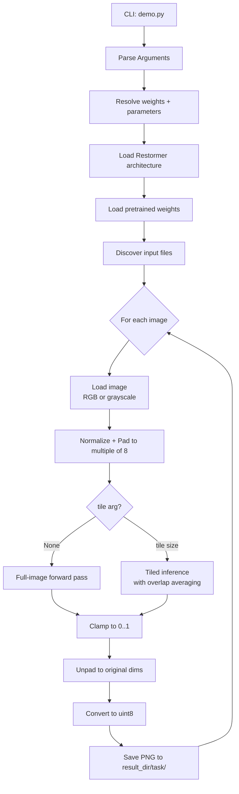

# Design: image restoration inference pipeline

This document describes the **technical design** of the CLI-driven inference pipeline (`demo.py`) and defines correctness properties that should hold across valid executions.

## Overview

The pipeline is a linear flow:

1. Parse CLI arguments
2. Resolve task → pretrained weights + model parameter overrides
3. Load Restormer architecture and checkpoint
4. Discover input images (single-file or directory)
5. For each image:
   - load (RGB or grayscale)
   - normalize + pad spatial dims to a multiple of 8
   - run inference (full-image or tiled)
   - clamp output to [0, 1]
   - unpad to original dimensions
   - save output PNG under `<result_dir>/<task>/`

## Architecture diagram

## Key components

### Task → weights + parameters

`demo.py:get_weights_and_parameters(task, parameters)` maps the six tasks to a weights path and applies task-specific overrides.

### Input loading

- RGB tasks use OpenCV read + BGR→RGB conversion.
- Grayscale denoising uses OpenCV grayscale read and expands dims to `(H, W, 1)`.

### Padding and unpadding

The model expects spatial dims to be divisible by 8. The pipeline:

- pads the tensor using reflect padding to the next multiple-of-8 size,
- then crops back to the original height/width after inference.

### Inference modes

- **Full-image**: one forward pass over the padded tensor.
- **Tiled**:
  - compute stride = `tile - tile_overlap`
  - iterate over tile start indices so the last tile lands exactly at `h-tile` / `w-tile`
  - accumulate outputs into an energy tensor `E` and weights tensor `W`
  - aggregate via `E / W` (averaging in overlap regions)

## Correctness properties

These properties are intended to be testable and to provide a bridge between requirements and implementation.

### Property 1: Padding produces dimensions divisible by 8

For any image height H and width W, after padding, the padded height H' and width W' are divisible by 8.

Validates: Requirements 3.3

### Property 2: Unpadding restores original dimensions

For any original (H, W), cropping the model output back to `[:, :, :H, :W]` yields exactly (H, W).

Validates: Requirements 4.3, 5.7

### Property 3: Output values are clamped to [0, 1]

After applying `torch.clamp(restored, 0, 1)`, all output values satisfy `0 <= value <= 1`.

Validates: Requirements 4.2, 5.6

### Property 4: File discovery returns supported files in natural sort order

From a directory containing a mix of supported and unsupported extensions, file discovery returns only supported images in natural sort order.

Validates: Requirements 2.2, 2.3

### Property 5: Tile coverage is complete

For any padded image size (H, W) and valid tile configuration, the union of all inferred tile regions covers every pixel position.

Validates: Requirements 5.1

### Property 6: Tile size is clamped to image dimensions

Effective tile size used is `min(tile, H, W)`.

Validates: Requirements 5.4

### Property 7: Output path is task-scoped subdirectory

Outputs are written to `os.path.join(result_dir, task)`.

Validates: Requirements 6.2

### Property 8: Output filename preserves input base name with PNG extension

Output filename is `stem + '.png'` where `stem` is the input basename without extension.

Validates: Requirements 6.4

## Error handling (current behavior)

- Invalid `--task`: argparse exits with error.
- Missing weights file: `torch.load` raises and exits.
- No supported images found: raises `Exception`.
- Invalid tile size (not multiple of 8): assertion error.

